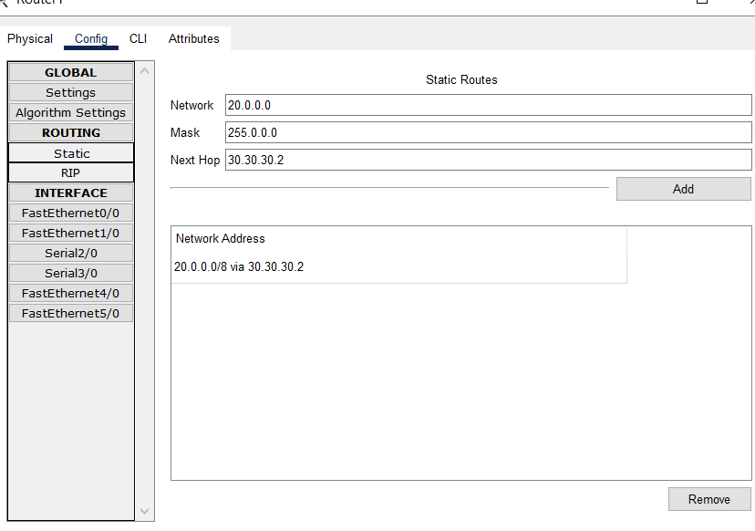
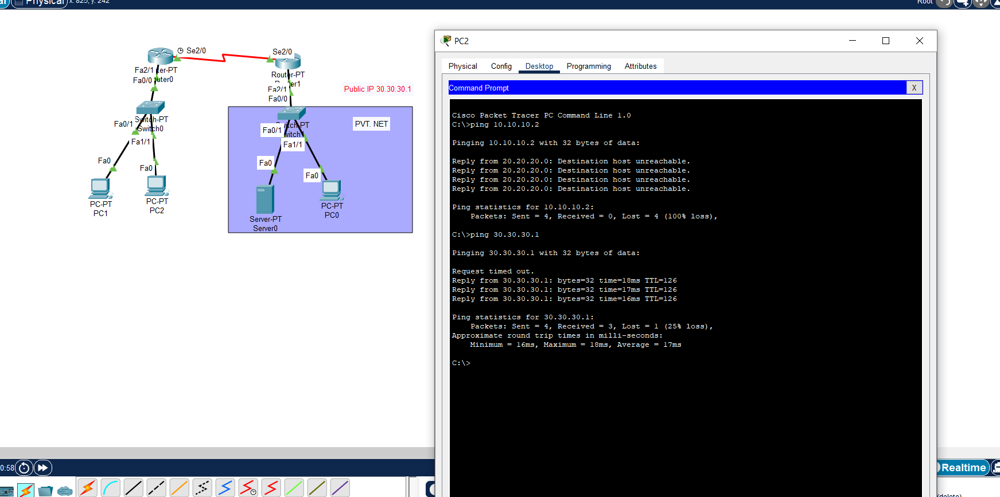
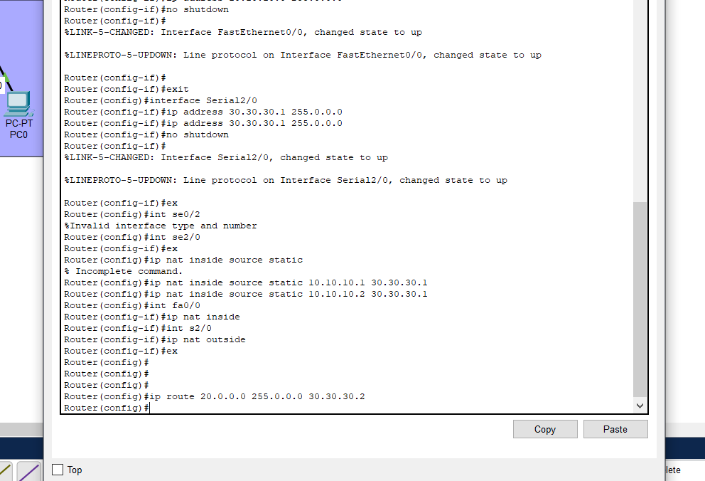
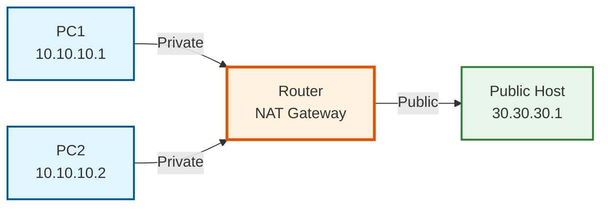

# static-nat-configuration
# 🌐 NAT Configuration Project

<div align="center">
  
  
  
  
</div>

<br/>

<p align="center">
  <em>A simple Network Address Translation (NAT) implementation using Cisco Packet Tracer, demonstrating how private networks can access public networks while maintaining security isolation.</em>
</p>

---

## 📋 Overview

<table>
<tr>
<td width="60%">

This project demonstrates a **basic NAT setup** where:

- 🔒 Private network devices (PC1 & PC2) with IPs `10.10.10.1` and `10.10.10.2`
- 🌐 Can access public network (`30.30.30.1`) through NAT
- 🚫 Cannot directly ping each other's private IPs from outside
- ⚙️ Router configured with static IP addressing

</td>
<td width="40%">

```
┌─────────────┐
│ Private Net │
│ 10.10.10.0  │
└──────┬──────┘
       │
   [Router NAT]
       │
┌──────┴──────┐
│ Public Net  │
│ 30.30.30.0  │
└─────────────┘
```

</td>
</tr>
</table>

---

## 🎯 Project Goals

<div align="center">

| Goal | Description |
|:----:|:------------|
| 🎓 | Demonstrate basic NAT functionality |
| 🔐 | Show network isolation between private and public networks |
| 💻 | Practice static IP configuration on Cisco routers |
| 🛡️ | Understand how NAT provides security through address translation |

</div>

---

## 📁 Files in this Repository

<details open>
<summary><b>Click to expand file details</b></summary>
<br/>

| File | Preview | Description |
|------|:-------:|-------------|
| `cisco.pkt` | 📦 | Main Cisco Packet Tracer topology file |
| `staticonfig.png` |  | Static IP configuration on router |
| `PROOFthatPC1and2cantpingingprivateIP.png` |  | Proof that NAT is working - PC1 and PC2 cannot ping private IPs but can reach public IP |
| `progress1.png` |  | CLI configuration progress screenshot |

</details>

---

## 🔧 Network Topology

<div align="center">



</div>

---

## 📸 Complete Configuration Process

### 1️⃣ Static IP Configuration
<div align="center">
  
  <p><em><b>Router static IP configuration</b> - Setting up interface IP addresses for NAT gateway</em></p>
</div>

**What's happening here:**
- Configuring router interfaces with appropriate IP addresses
- Setting up the gateway between private (10.10.10.0/24) and public (30.30.30.0/24) networks
- Enabling interfaces and verifying connectivity

<br/>

### 2️⃣ CLI Configuration Progress
<div align="center">
  
  <p><em><b>Active CLI configuration</b> - Configuring NAT rules and routing via command line interface</em></p>
</div>

**Configuration steps being performed:**
```cisco
Router(config)# interface g0/0
Router(config-if)# ip address 10.10.10.254 255.255.255.0
Router(config-if)# ip nat inside
Router(config-if)# no shutdown

Router(config)# interface g0/1
Router(config-if)# ip address 30.30.30.254 255.255.255.0
Router(config-if)# ip nat outside
Router(config-if)# no shutdown

Router(config)# ip nat inside source list 1 interface g0/1 overload
Router(config)# access-list 1 permit 10.10.10.0 0.0.0.255
```

<br/>

### 3️⃣ NAT Verification & Testing
<div align="center">
  
  <p><em><b>Proof of NAT functionality</b> - Testing network isolation and public access</em></p>
</div>

<br/>

<table align="center">
<tr>
<td align="center" width="50%">

### ❌ Private Network Isolation

**Test: Ping Private IPs**
- PC1 → PC2 (10.10.10.2): ❌ **UNREACHABLE**
- PC2 → PC1 (10.10.10.1): ❌ **UNREACHABLE**

Shows "Destination host unreachable"

✅ **This is correct behavior!**

</td>
<td align="center" width="50%">

### ✅ Public Network Access

**Test: Ping Public IP**
- PC1 → Public (30.30.30.1): ✅ **SUCCESS**
- PC2 → Public (30.30.30.1): ✅ **SUCCESS**

NAT translation working correctly! 🎉

✅ **Private IPs are translated!**

</td>
</tr>
</table>

> **💡 What does this prove?**
> - Private addresses (10.10.10.x) are hidden from the public network
> - NAT router successfully translates private IPs to public IP (30.30.30.254)
> - Network isolation is maintained - devices cannot directly access each other's private addresses
> - Security through address translation is working as intended

---

## 🚀 Getting Started

### Prerequisites

<div align="center">


</div>

### Installation Steps

```bash
# 1. Clone this repository
git clone https://github.com/renaiyd/nat-config.git

# 2. Navigate to the project directory
cd nat-config

# 3. Open cisco.pkt in Cisco Packet Tracer
```

---

## 📝 Step-by-Step Configuration Guide

<div align="center">

```
Step 1: Static IP      Step 2: NAT Rules      Step 3: Testing      Step 4: Verification
    ⬇️                      ⬇️                     ⬇️                    ⬇️
Configure router    →  Define inside/      →  Ping tests       →  Analyze results
interfaces             outside interfaces      from PCs              & confirm NAT
```

</div>

### Detailed Commands

<table>
<tr>
<td>

**Step 1: Configure Inside Interface**
```cisco
Router(config)# interface g0/0
Router(config-if)# ip address 10.10.10.254 255.255.255.0
Router(config-if)# ip nat inside
Router(config-if)# no shutdown
Router(config-if)# exit
```

</td>
<td>

**Step 2: Configure Outside Interface**
```cisco
Router(config)# interface g0/1
Router(config-if)# ip address 30.30.30.254 255.255.255.0
Router(config-if)# ip nat outside
Router(config-if)# no shutdown
Router(config-if)# exit
```

</td>
</tr>
<tr>
<td>

**Step 3: Configure NAT Overload (PAT)**
```cisco
Router(config)# ip nat inside source list 1 interface g0/1 overload
Router(config)# access-list 1 permit 10.10.10.0 0.0.0.255
```

</td>
<td>

**Step 4: Verify Configuration**
```cisco
Router# show ip nat translations
Router# show ip nat statistics
Router# show ip interface brief
```

</td>
</tr>
</table>

---

## 🔍 Understanding the Results

### What Each Screenshot Shows:

#### 📊 Static Config (`staticconfig.png`)
- Initial router configuration
- IP address assignment
- Interface status

#### ⚙️ Progress (`progress1.png`)
- Live CLI configuration
- Commands being entered
- Real-time setup process

#### ✅ Proof (`PROOFthatPC1and2cantpingingprivateIP.png`)
- Ping test results
- Network isolation verification
- Public network accessibility confirmation

---

## 🎓 Learning Outcomes

<div align="center">

| 📚 Topic | 🎯 Outcome | 🖼️ Shown In |
|:---------|:-----------|:------------|
| **NAT Translation** | Understand how NAT translates private IPs to public IPs | All screenshots |
| **Network Security** | Learn why NAT provides security through isolation | `PROOFthatPC1and2...png` |
| **Cisco IOS** | Practice configuring NAT via CLI | `progress1.png` |
| **Static IP** | Configure router interfaces properly | `staticconfig.png` |

</div>

---

## 🛠️ Troubleshooting

<details>
<summary><b>🔴 Common Issues & Solutions</b></summary>

### Issue 1: Cannot ping public IP
**Solution:** Check if NAT is configured correctly
```cisco
Router# show ip nat translations
Router# show running-config | include nat
```

### Issue 2: Private IPs can ping each other
**Solution:** Verify NAT inside/outside interfaces
```cisco
Router# show ip interface brief
```

### Issue 3: Router interfaces are down
**Solution:** Enable interfaces
```cisco
Router(config-if)# no shutdown
```

</details>

---

## 🤝 Contributing

Contributions, issues, and feature requests are welcome!

<div align="center">

[](https://github.com/renaiyd/nat-config/fork)
[](https://github.com/renaiyd/nat-config)
[](https://github.com/renaiyd/nat-config/issues)

</div>

---

## 📞 Connect With Me

<div align="center">

[](https://github.com/renaiyd)
[](mailto:your-email@example.com)

</div>

---

## 📄 License

<div align="center">

This project is licensed under the **MIT License** - see the [LICENSE](LICENSE) file for details.

Copyright © 2024 [@renaiyd](https://github.com/renaiyd)

</div>

---

<div align="center">

### ⭐ Star this repo if you find it helpful!

**Made with ❤️ and lots of ☕**


</div>
